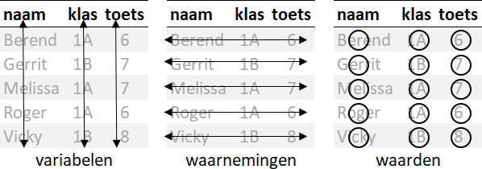
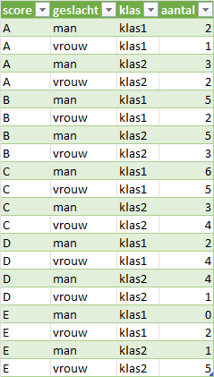
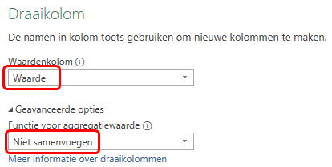
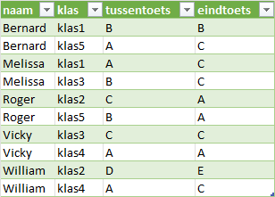
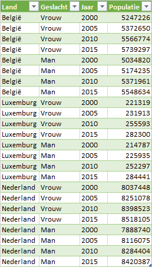
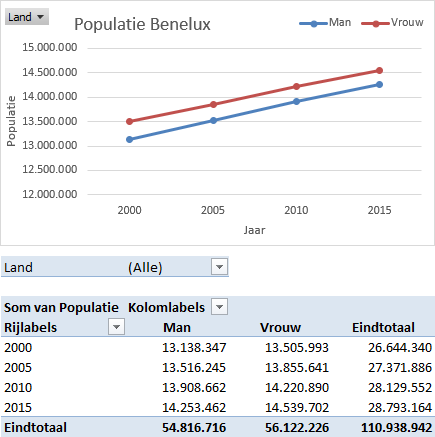

# Data en Variabelen {#sec-data-variabelen}



::: callout-intro
Data bestaat uit waarnemingen van meetgegevens, dat zijn de variabelen. In dit hoofdstuk wordt uitgelegd welke soort variabelen er zijn en welke bewerkingen je mag toepassen.

Wanneer je data uit externe bronnen importeert, heb je geen controle over de indeling en het type gegevens en de manier waarop de data is georganiseerd. Voordat je met de analyse kunt beginnen moet je daarom vaak veel tijd steken om de data te herstructureren. Het tweede deel van dit hoofdstuk gaat hierover.
:::

## Variabelen {#sec-variabelen}

Bij het importeren van de gegevens heb je de variabelen al gedefinieerd en zijn ze van een naam voorzien. Je moet verder ook nog weten wat voor een soort waarden de variabele kan hebben om later te kunnen bepalen welke statistische methodes geschikt zijn voor de variabele. In grote lijnen zijn alle variabelen ofwel **kwantitatieve** (numerieke) variabelen waarvan de gegevens uit een getelde of gemeten hoeveelheid bestaat, of **categoriale** variabelen waarvan de gegevens groepen (categorieën) vertegenwoordigen. Zo is een variabele `weekomzet` een kwantitatieve variabele omdat de waarden hiervan hoeveelheden zijn. En een variabele als `geslacht` met de categorieën `Man` en `Vrouw` is een categoriale variabele.

Soms moet je een kwantitatieve variabele verder specificeren als *discreet* of *continu*. Discrete kwantitatieve variabelen hebben waarden die voortkomen uit tellingen, ze vertegenwoordigen een aantal van iets, zoals het aantal leerlingen in een klas. Continue kwantitatieve variabelen hebben waarden die voortkomen uit metingen, zoals de lengte van een persoon, welke in principe elke waarde binnen een interval kan aannemen (afhankelijk van de nauwkeurigheid van het meetinstrument).

### Meetniveaus {#sec-meetschaal}

Variabelen worden in vier meetniveaus (schalen) ingedeeld: nominaal, ordinaal, interval en ratio.

```{mermaid}
%%| label: fig-meetniveaus
%%| fig-cap: Meetniveaus van variabelen

flowchart LR
  A(Variabele) --> C[Categoriaal]
  A --> K[Kwantitatief]
  C --> N[Nominaal]
  C --> O[Ordinaal]
  K --> I[Interval]
  K --> R[Ratio]
```

**Nominaal**

Een variabele op **nominaal niveau** (ook wel een **categorische** variabele genoemd) is een variabele waarbij de waarden (**categorien**) uit namen (naam in het Latijn is *nomen*) bestaan waarbij ook geen relatie tussen de mogelijkheden bestaat. De gegevens zijn kwalitatief of beschrijvend. De waarden hebben ook geen logische volgorde. Je kunt niet aangeven dat de ene waarde groter is dan de andere waarde, of de gemiddelde waarde berekenen. Het enige dat je kunt zeggen is dat de mogelijkheden van elkaar verschillen.

Voorbeelden: geslacht, nationaliteit, godsdienst, woonplaats, burgerlijke staat, oogkleur, beroep, studierichting, industrietak, ....

**Ordinaal**

Variabelen op **ordinaal niveau** hebben iets meer structuur dan nominale variabelen, maar niet veel. Bij een ordinale variabele is er een natuurlijke zinvolle manier om de waarden te ordenen, bijvoorbeeld van klein naar groot of van meer dan minder. Voorbeelden: restaurantclassificatie (aantal sterren), enquêtevragen (*Likertschalen*: 1=zeer goed, 2=goed, ...), plaats in wedstrijduitslag (1, 2, 3, ...). Met de waarden kun je geen rekenkundige bewerkingen uitvoeren, zoals een gemiddelde berekenen.

Zo is een restaurant met 2 sterren beter dan eentje met 1 ster, maar je kunt niet zomaar zeggen 2 keer beter. En bij de uitslag van een maraton is de eerste sneller dan de tweede en is deze weer sneller dan de derde, enz. Maar het verschil tussen de eerste plaats en de tweede plaats kan anders zijn dan het verschil tussen de tweede en de derde plaats.

Voorbeelden: beoordeling (1=zeer slecht, 2=slecht, 3=matig, 4=goed, 5=zeer goed), medaille (goud, zilver, brons), T-shirt maten (S, M, L, XL), ...

**Interval**

In tegenstelling tot nominale en ordinale variabelen, zijn variabelen op **intervalniveau** en rationiveau variabelen waarbij de numerieke waarde echt van betekenis is. De gegevens zijn kwantitatief, maar hebben geen "natuurlijk" nulpunt. De keuze van een nulpunt is vaak arbitrair. De **verschillen** tussen de waarden (intervallen) heeft wel betekenis. Sommige rekenkundige bewerkingen kun je uitvoeren zoals optellen, aftrekken, gemiddelde bepalen. Maar je kunt niet vermenigvuldigen of delen.

Een goed voorbeeld van een variabele op intervalniveau is het meten van temperatuur in graden Celsius. Het nulpunt van 0°C is willekeurig gekozen, namelijk de temperatuur waarbij water bevriest. De verschillen hebben betekenis. Zo is het verschil tussen 12°C en 18°C even groot als het verschil tussen 18°C en 24°C. Maar je kunt niet zeggen dat 24°C twee keer zo warm is als 12°C.

Voorbeelden: jaartal, datum, kloktijd, ...

**Ratio**

Bij een variabele op **rationiveau** (verhoudingsniveau) is er een echt nulpunt, waarbij nul ook echt nul betekent. Een ratiovariabele meet dus de omvang van de variabele. Bij deze variabelen mag je wel vermenigvuldigen en delen. Zo is een salaris van €4000 twee keer zo groot als een salaris van €2000.

Voorbeelden: inkomen, uitgaven, gewicht, lengte, snelheid, massa, reactietijd

**Samengevat**

-   kwalitatieve variabele (nominaal, ordinaal)
    -   wordt niet numeriek gemeten, elke waarde heet ook wel categorie
    -   geen rekenkundige bewerkingen, wel aantallen tellen per categorie
-   kwantitatieve variabele (interval, ratio)
    -   wordt numeriek gemeten
    -   rekenkundige bewerkingen zijn mogelijk

### Continue - discrete variabelen

Er is nog een tweede soort onderscheid waar je op bedacht moet zijn bij de typen variabelen, namelijk het onderscheid tussen continue variabelen en discrete variabelen.

- **Continue variabele**: een variabele waarbij het voor elke twee waarden die je kunt bedenken, logischerwijs altijd mogelijk is dat er nog een andere waarde tussen ligt.

- **Discrete variabele** is in feite een variabele die niet continu is. Bij een discrete variabele is het soms zo dat er daartussenin niets mogelijk is.

::: {#tbl-meetniveau}
| meetniveau | continu    | discreet   |
|------------|:----------:|:----------:|
| nominaal   |            |$\checkmark$|
| ordinaal   |            |$\checkmark$|
| interval   |$\checkmark$|$\checkmark$|
| ratio      |$\checkmark$|$\checkmark$|

: Het verband tussen de meetschalen en het onderscheid tussen discreet en continu. Een vinkje geeft aan wat mogelijk is.
:::

::: callout-note
Een jaartal, bijvoorbeeld het bouwjaar van een auto, wordt doorgaans beschouwd als een discrete kwantitatieve variabele en niet als een ordinale variabele. Echter afhankelijk van de context kan het nodig zijn om een jaarvariabele als een ordinale variabele te behandelen.
:::

::: {.content-visible when-format="html:js"}
**Testvragen**

1.  Welk type variabele is de medaillesoort die een atleet op de Olympische spelen kan winnen? `r mcq(c("Interval", "Nominaal", answer = "Ordinaal", "Ratio"))`

2.  Welk type variabele is de tijd van een atleet voor het lopen van een marathon? `r mcq(c("Interval", "Nominaal", "Ordinaal", answer = "Ratio"))`

3.  De Nederlandse nationale politie kent een aantal rangen. Welk type variabele is de rang? `r mcq(c("Interval", "Nominaal", answer = "Ordinaal", "Ratio"))`
:::

## Gestructureerde gegevens

Vaak zijn de gegevens zijn niet goed gestructureerd, waardoor je niet met draaitabellen kunt werken of de gewenste grafieken niet kunt maken. Wanneer de gegevens goed gestructureerd zijn kun je ze gemakkelijker modelleren, visualiseren en transformeren waardoor de analyse eenvoudiger wordt.

Gestructureerde gegevens moeten voldoen aan de volgende voorwaarden:

1.  Elke gemeten variabele staat in een kolom.

2.  Elke waarneming van de variabele staat in een rij.

{#fig-tidy-data}

In @tbl-exp1 staan de gegevens van een meting bij een klein denkbeeldig experiment in een formaat dat je (vooral in spreadsheets) veel tegenkomt.

```{r}
#| label: tbl-exp1
#| echo: false
#| tbl-cap: Deelnemers als rij.

exp <- read.csv("resources/experiment.csv", header = TRUE, sep=";")
exp_w1 <- exp |>
  pivot_wider(names_from = Behandeling, values_from = Meetwaarde)
flextable(exp_w1) |> autofit()
```

Wanneer je de rijen en kolommen verwisselt heb je dezelfde gegevens, maar de tabel ziet er dan iets anders uit, zie @tbl-exp2.

```{r}
#| label: tbl-exp2
#| echo: false
#| tbl-cap: Behandelingen als rij.

exp_w2 <- exp |>
  pivot_wider(names_from = Deelnemer, values_from = Meetwaarde)
flextable(exp_w2) |> autofit()
```

In feite telt deze gegevensverzameling drie variabelen: `Naam`, `Behandeling` en `Meetwaarde`. Gestructureerd ziet deze gegevensverzameling er uit zoals in @tbl-exp3.

```{r}
#| label: tbl-exp3
#| echo: false
#| tbl-cap: Gegevens in gestructureerde vorm

flextable(exp) |> autofit()
```

Dit maakt de waarden, variabelen en waarnemingen duidelijker.

Echte gegevensverzamelingen zijn vaak op bijna elke denkbare manier in strijd met de voorwaarden voor gestructureerde gegevens. De meest voorkomende problemen bij niet goed gestructureerde gegevensverzamelingen zijn:

-   Kolomkoppen bevatten waarden van een variabele i.p.v. een variabelenaam.
-   Combinatie van variabelen in een kolom.
-   Variabelen in zowel rijen als kolommen.

In de taken hierna zullen in kleine voorbeelden deze problemen gedemonstreerd worden en opgelost worden met behulp van Power Query.

### Kolomkoppen met waarden

Een veel voorkomende vorm van een gegevensverzameling is een tabelvorm waarbij de kolomkoppen waarden zijn en geen variabelenamen. @tbl-scores1-data is hier een voorbeeld van. Hierin staat het aantal mannelijke en vrouwelijke studenten dat een bepaalde score (A t/m E) behaald heeft.

```{r}
#| label: tbl-scores1-data
#| echo: false
#| tbl-cap: De kolomkoppen man en vrouw zijn in feite waarden van de variabele geslacht.

scores1 <- read_xlsx("data/scores1.xlsx")
flextable(scores1)
```

Deze gegevensverzameling heeft in feite drie variabelen:

-   `score` - met de waarden `A` t/m `E`
-   `geslacht` - met de waarden `man` en `vrouw`
-   `aantal` - met het aantal keren dat de score behaald is, de frequentie

Het probleem is dus dat de waarden van de variabele `geslacht` in twee kolomkoppen staat.

De eerste variabele `score` is al een kolom, dat moet dus zo blijven. Voor de variabelen `geslacht` en `aantal` moeten nieuwe kolommen gemaakt worden. Voor elke combinatie van `score` en `geslacht` moet een rij gemaakt worden.

::: {#prp-data-scores1}
[Hulpbestand]{.smallcaps}: `scores1.xlsx`

1.  Open het hulpbestand.

2.  Selecteer een willekeurige cel met gegevens en kies [tab Gegevens \> Vanaf blad (Gegevens ophalen en transformeren)]{.uicontrol}. Het dialoogvenster ***Tabel maken*** verschijnt, waarin de tabelgegevens gespecificeerd kunnen worden. Het gegevensgebied is standaard al goed ingevuld.

3.  Zorg er voor dat de optie voor kopteksten geselecteerd is en klik [OK]{.uicontrol}. Op het werkblad worden de gegevens allereerst in een Excel tabel omgezet. Daarna wordt in een nieuw venster de Power Query-editor opgestart die de gegevens uit de tabel inleest.

4.  Selecteer in de Power Query editor de eerste kolom `score`.

5.  Kies [tab Transformeren \> Draaitabel opheffen voor kolommen (groep Alle kolommen) \> Draaitabel voor andere kolommen opheffen]{.uicontrol}. Er worden twee nieuwe kolommen gemaakt. Een kolom `Kenmerk` (met de waarden voor variabele `geslacht`) en een kolom `Waarde` met de aantallen. En voor elke combinatie van `score` en `geslacht` is een rij gemaakt.

6.  Selecteer kolom `Kenmerk`, dan [Rechter muisklik \> Naam wijzigen]{.uicontrol} en wijzig de naam in `geslacht`.

7.  Wijzig op dezelfde manier de naam van kolom `Waarde` in `aantal`.

8.  Kies [tab Startpagina \> Sluiten en laden \> Sluiten en laden]{.uicontrol}.

Het resultaat is een tabel met gestructureerde gegevens. Elke kolom is één variabele en elke rij is één waarneming.


```{r}
#| label: tbl-scores1-tidy
#| echo: false
#| tbl-cap: Scores1 in een gestructureerde tabel.

scores1 |> pivot_longer(cols = -score,
						names_to = "geslacht",
						values_to = "aantal") |>
	       flextable()
```

:::

### Kolomkoppen zijn gecombineerde variabelen

Soms zijn kolommen een combinatie van meerdere onderliggende variabelen. Dit is het geval bij de gegevensverzameling in @tbl-scores2-data. Deze is gelijkwaardig aan die in de vorige taak. Alleen zijn er nu twee verschillende klassen (klas1 en klas2) en staat het aantal voor elk geslacht in elke klas in een eigen kolom. Ook in deze gegevensverzameling zijn de kolomkoppen waarden van variabelen. Maar er zijn twee variabelen, `geslacht` en `klas`, in één kolom gecombineerd.

```{r}
#| label: tbl-scores2-data
#| echo: false
#| tbl-cap: De kolomkoppen een combinatie van de variabelen geslacht en klas.

scores2 <- read_xlsx("data/scores2.xlsx")
flextable(scores2)
```

::: {#prp-data-scores2}
[Hulpbestand]{.smallcaps}: `scores2.xlsx`

1.  Open het hulpbestand.

2.  Selecteer een willekeurige cel met gegevens en kies [tab Gegevens \> Vanaf blad (Gegevens ophalen en transformeren)]{.uicontrol}. Het dialoogvenster ***Tabel maken*** verschijnt, waarin de tabelgegevens gespecificeerd kunnen worden. Het gegevensgebied is standaard al goed ingevuld.

3.  Zorg er voor dat de optie voor kopteksten geselecteerd is en klik [OK]{.uicontrol}. Op het werkblad worden de gegevens allereerst in een Excel tabel omgezet. Daarna wordt in een nieuw venster de Power Query-editor opgestart die de gegevens uit de tabel inleest.

4.  Selecteer in de Power Query editor de eerste kolom `score`.

5.  Kies [tab Transformeren \> Draaitabel opheffen voor kolommen (groep Alle kolommen) \> Draaitabel voor andere kolommen opheffen]{.uicontrol}. Er worden twee nieuwe kolommen gemaakt. Een kolom `Kenmerk` (met de waarden voor `geslacht_klas`) en een kolom `Waarde` met de aantallen. En voor elke combinatie van `score` en `geslacht_klas` is een rij gemaakt.

6.  Selecteer kolom `Kenmerk` en kies [tab Transformeren \> Kolom splitsen (groep Kolom Tekst) \> Op scheidingsteken]{.uicontrol}. In het dialoogvenster is reeds het juiste scheidingsteken (`_`) waarop gesplitst moet worden, geselecteerd.

7.  Klik [OK]{.uicontrol}. De kolom `Kenmerk` is gesplitst in kolom `Kenmerk.1` (met de waarden voor variabele `geslacht`) en `Kenmerk.2` (met de waarden voor variabele `klas`).

8.  Wijzig de namen van de kolommen `Kenmerk.1`, `Kenmerk.2` en `Waarde` in respectievelijk `geslacht`, `klas` en `aantal`.

9.  Kies [tab Startpagina \> Sluiten en laden \> Sluiten en laden]{.uicontrol}.

Het resultaat is een tabel met gestructureerde gegevens. Elke kolom is één variabele en elke rij is één waarneming.

{#fig-scores2-result}
:::

### Variabelen in rijen en kolommen

Een meer gecompliceerde vorm van rommelige gegevens krijg je wanneer er variabelen in zowel rijen als kolommen staan. In het voorbeeld hierna staan de beoordelingen voor een tussentoets en een eindtoets voor vijf studenten, waarbij elk van hen in precies twee van de vijf mogelijke klassen is geplaatst.

```{r}
#| label: tbl-scores3-data
#| echo: false
#| tbl-cap: Variabelen in zowel rijen als kolommen.

scores3 <- read_xlsx("data/scores3.xlsx")
flextable(scores3)
```

De eerste kolom met de variabele `naam` is in orde en moet zo blijven. De koppen van de laatste vijf kolommen zijn allemaal waarden van de variabele `klas`. De waarden in de tweede kolom, `tussentoets` en `eindtoets`, moeten eigen variabelen worden met als waarde de beoordeling van de student op dit onderdeel.

::: {#prp-data-scores3}
[Hulpbestand]{.smallcaps}: `scores3.xlsx`

1.  Open het hulpbestand.

2.  Selecteer een willekeurige cel met gegevens en kies [tab Gegevens \> Vanaf blad (Gegevens ophalen en transformeren)]{.uicontrol}. Het dialoogvenster ***Tabel maken*** verschijnt, waarin de tabelgegevens gespecificeerd kunnen worden. Het gegevensgebied is standaard al goed ingevuld.

3.  Zorg er voor dat de optie voor kopteksten geselecteerd is en klik [OK]{.uicontrol}. Op het werkblad worden de gegevens allereerst in een Excel tabel omgezet. Daarna wordt in een nieuw venster de Power Query-editor opgestart die de gegevens uit de tabel inleest.

4.  Selecteer in de Power Query editor de laatste vijf kolommen `klas1` t/m `klas5`.

5.  Kies [tab Transformeren \> Draaitabel opheffen voor kolommen (groep Alle kolommen) \> Draaitabel opheffen voor kolommen]{.uicontrol}. Er worden twee nieuwe kolommen gemaakt. Een kolom `Kenmerk` (met de waarden voor variabele `klas`) en een kolom `Waarde` met de beoordeling. En voor elke combinatie van `naam`, `toets` en `klas` is een rij gemaakt.

6.  Wijzig de naam van kolom `Kenmerk` in `klas`.

7.  Selecteer kolom `toets` en kies [tab Transformeren \> Draaikolom (groep Alle kolommen)]{.uicontrol}. Het dialoogvenster ***Draaikolom*** verschijnt

8.  Kies als [Waardenkolom]{.uicontrol} `Waarde`. En geef onder [Geavanceerde opties]{.uicontrol} aan dat er niet samengevoegd moet worden.

{#fig-scores3-pivotcolumn}

9.  Klik [OK]{.uicontrol}.

10. Kies [tab Startpagina \> Sluiten en laden \> Sluiten en laden]{.uicontrol}.

Het resultaat is een tabel met gestructureerde gegevens. Elke kolom is één variabele en elke rij is één waarneming.

{#fig-scores3-result}
:::

## TAAK: Populatie Benelux {#sec-benelux-populatie}

@tbl-benelux-populatie bevat de populatie mannen en vrouwen in de landen van de Benelux voor de jaren 2000, 2005, 2010 en 2015.

```{r}
#| label: tbl-benelux-populatie
#| echo: false
#| tbl-cap: Populatie Benelux voor de jaren 2000, 2005, 2010 en 2015.

bnl <- read_xlsx("data/scores1.xlsx")
bnl <- read_xlsx("data/benelux-populatie.xlsx")
flextable(bnl)
```

Deze gegevens wil je analyseren en bijvoorbeeld de ontwikkeling van de populatie per geslacht per jaar bestuderen en dat eventueel nog per land. Een draaitabel en draaigrafiek lenen zich daar het beste voor.

Echter de gegevens staan niet in een goed gestructureerde Exceltabel. In feite heeft deze tabel vier variabelen: `Land`, `Geslacht`, `Jaar` en `Populatie`. De eerste twee variabelen staan in een eigen kolom, dat moet zo blijven. De laatste vier kolomkoppen zijn de waarden van de variabele `Jaar` en de inhoud van deze kolommen is de waarde van de variabele `Populatie`. De tabel moet dus eerst gestructureerd worden voordat met de analyse begonnen kan worden.

:::: {#prp-data-benelux}
[Hulpbestand]{.smallcaps}: `benelux-populatie.xlsx`

*Structureren data*

1.  Open het hulpbestand.

2.  Selecteer een willekeurige cel met gegevens en kies [tab Gegevens \> Vanaf blad (Gegevens ophalen en transformeren)]{.uicontrol}. Het dialoogvenster ***Tabel maken*** verschijnt, waarin de tabelgegevens gespecificeerd kunnen worden. Het gegevensgebied is standaard al goed ingevuld.

3.  Zorg er voor dat de optie voor kopteksten geselecteerd is en klik [OK]{.uicontrol}. Op het werkblad worden de gegevens allereerst in een Excel tabel omgezet. Daarna wordt in een nieuw venster de Power Query-editor opgestart die de gegevens uit de tabel inleest.

4.  Selecteer in de Power Query editor de eerste twee kolommen, met `Land` en `Geslacht`.

5.  Kies [tab Transformeren \> Draaitabel opheffen voor kolommen (groep Alle kolommen) \> Draaitabel voor andere kolommen opheffen]{.uicontrol}. Er worden twee nieuwe kolommen gemaakt. Een kolom `Kenmerk` (met de waarden voor variabele `Jaar`) en een kolom `Waarde` met de populatiegetallen. En voor elke combinatie van `Land`, `Geslacht` en `Jaar` is een rij gemaakt.

::: callout-note
Je had er ook voor kunnen kiezen om de laatste vier kolommen met de jaartallen te selecteren en dan te kiezen voor het opheffen van de draaitabel voor deze kolommen. Dit heeft als nadeel dat de query niet meer goed werkt wanneer er later in de brongegevens een nieuwe kolom met de populatie voor het jaar 2020 wordt toegevoegd.
:::

6.  Wijzig de namen van de kolommen `Kenmerk` en `Waarde` in respectievelijk `Jaar` en `Populatie`.

7.  Kies [tab Startpagina \>Sluiten en laden (groep Sluiten)]{.uicontrol}. De gegevens worden nu in een nieuwe tabel in een nieuw werkblad gezet.

De gegevens staan nu in een gestructureerde Excel tabel en zijn nu geschikt voor het maken van draaitabellen en draaigrafieken.

{#fig-benelux-tidy}

*Analyse*

8.  Maak de volgende draaitabel en draaigrafiek.

{#fig-benelux-pivot-chart}
::::

## Opgaven {#sec-opg-data}

::: {#exr-data-waarnemingen}
**waarnemingen en variabelen**

In @tbl-persoonskenmerken zie je een dataset met een aantal persoonsgegevens.

```{r}
#| label: tbl-persoonskenmerken
#| echo: false
#| tbl-cap: Kenmerken van een aantal personen.

persoonskenmerken <- data.frame(
  voornaam = c("Chris", "Mari", "Otto", "Peter", "Vicky"), 
  geslacht = c("m", "v", "m", "m", "v"),
  haarkleur = c("bruin", "blond", "blond", "zwart", "rood"), 
  lengte = c("groot", "groot", "normaal", "normaal", "klein"),
  gewicht = c(185, 176, 181, 178, 164), 
  iq = c(95, 104, 98, 108, 112))

flextable(persoonskenmerken)
```

a.  Hoeveel waarnemingen en hoeveel variabelen telt de dataset in @tbl-persoonskenmerken?
b.  Geef voor elke variabele aan tot welk meetniveau deze variabele behoort.
:::

::: {#exr-data-tekstberichten}
**Tekstberichten**

Bij een onderzoek wordt aan personen gevraagd om bij te houden hoeveel tekstberichten ze per dag versturen en hoeveel tijd ze hieraan besteden. Welke variabelen heb je hier en zijn deze discreet of continu?
:::

::: {#exr-koffieprijzen}
**Koffieprijzen**

Het bestand `koffieprijzen.xlsx` bevat een aantal koffieprijzen van Starbucks, zie de tabel in @tbl-koffieprijzen.

```{r}
#| label: tbl-koffieprijzen
#| echo: false
#| tbl-cap: Starbucks koffieprijzen voor drie verschillende groottes.

koffieprijzen <- read_xlsx("data/koffieprijzen.xlsx")
flextable(koffieprijzen) |> autofit()
```

a.  Ga na dat de tabel in feite drie variabelen bevat en dat de waarden van een van de variabelen in de kolomkoppen staat.
b.  Maak hiervan een gestructureerde dataset.
:::

:::: {#exr-data-levensonderhoud}
**Kosten levensonderhoud**

Om de kosten van levensonderhoud in Europa te vergelijken zijn via de website van [Numbeo](https://www.numbeo.com/cost-of-living/) voor een aantal plaatsen de gemiddelde marktprijzen verzameld voor brood (wit, 500 gram), kaas(lokaal, 1 kg), melk (gewoon, 1 liter) en rijst (wit, 1 kg). De data staan in het bestand `levensonderhoud.xlsx`. Voor de eerste 10 plaatsen zijn de gegevens te zien in de tabel in @tbl-levensonderhoud.

```{r}
#| label: tbl-levensonderhoud
#| echo: false
#| tbl-cap: Gemiddelde prijzen voor vier produkten (data download op 15-11-2025).

levensonderhoud <- read_xlsx("data/levensonderhoud.xlsx")
flextable(levensonderhoud[1:8,]) |> autofit()
```

a.  Maak hiervan een gestructureerde dataset.
b.  In welk land is rijst gemiddeld het goedkoopst en in welk land het duurst?

::: callout-tip
De gegevens zijn geïmporteerd van de Numbeo website met Power Query. Desgewenst kun je de gegevens actualiseren door de query opnieuw uit te voeren met [Gegevens \> Alles vernieuwen \> Alles vernieuwen (groep Query's en verbindingen)]{.uicontrol}.
:::
::::

::: {#exr-data-basisschool}
**Toets basisschool**

Op een bepaalde basischool krijgt elke leerling krijgt in elk kwartaal (Herfst, Winter en Lente) van elk jaar een toets voor rekenen en taal. Het bestand `rekenentaal.xlsx` bevat een beperkte gegevensverzameling hiervan en is te zien in de tabel in @tbl-rekenentaal.

```{r}
#| label: tbl-rekenentaal
#| echo: false
#| tbl-cap: Schoolresultaten voor rekenen en taal.

rekenentaal <- read_xlsx("data/rekenentaal.xlsx")
flextable(rekenentaal)
```

De analyse-eenheid is ID-Jaar-Kwartaal. Dus elke waarneming is die van een leerling gedurende een kwartaal in een bepaald jaar.

a.  Maak hiervan een gestructureerde gegevensverzameling.
b.  Maak een draaigrafiek (staafdiagram) van de gemiddelde scores voor rekenen en taal per jaar.
:::
